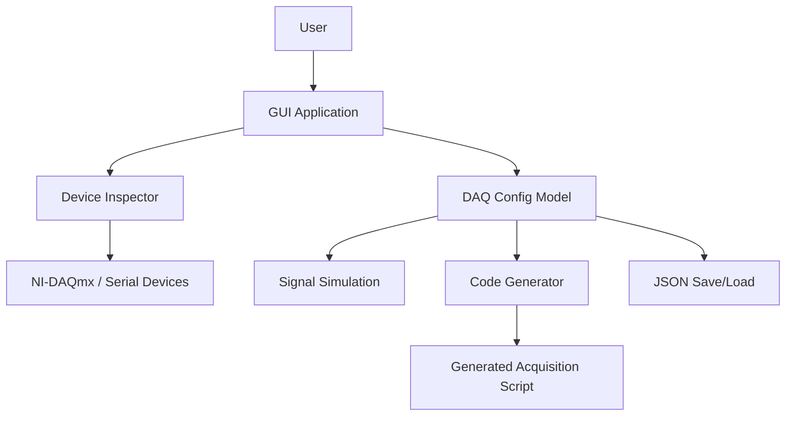

# DAQ Suite — Intelligent Data Acquisition Configuration & Code Generation

A Python-based data acquisition toolkit for configuring devices, simulating live signals, and generating device-specific code for acquisition workflows.

## Overview

**DAQ Suite** helps users discover connected DAQ hardware, validate acquisition parameters, and generate code for multiple target systems. It is designed for research, development, and embedded-system prototyping, especially when hardware availability varies across environments.

This project addresses a practical problem: configuring DAQ systems manually is time-consuming and error-prone. The app centralizes device discovery, channel validation, simulation, and code generation into a single workflow.

## Features

- Interactive **Tkinter GUI** for DAQ configuration
- Device discovery for **NI-DAQmx** and **serial/COM devices**
- Live **time-domain** and **FFT signal visualization**
- **JSON configuration save/load**
- Automatic code generation for different target types
- Simulation mode when hardware is unavailable
- Windows executable packaging support via **PyInstaller**

## Tech Stack

| Technology | Purpose |
|---|---|
| Python 3.11+ | Application runtime |
| Tkinter | Desktop GUI |
| NumPy | Signal processing |
| Matplotlib | Plotting and visualization |
| pyserial | Serial port communication |
| nidaqmx | NI hardware support |
| PyInstaller | Windows packaging |
| pytest | Testing |

## Architecture



## Project Structure

```text
DAQ_systems/
├── gui.py                 # Main desktop GUI
├── main.py                # CLI entry point
├── daq_config.py          # Parameter validation and config model
├── device_inspector.py    # Hardware detection and capability scanning
├── code_generator.py      # Target-specific code generation
├── requirements.txt       # Python dependencies
├── .gitignore             # Ignore generated/runtime files
├── README.md              # Project documentation
├── src/                   # Extended project modules
└── tests/                 # Automated tests (if present)
```

## Requirements

- Python 3.11.9 or newer
- NI-DAQmx drivers for real hardware access (optional)
- Serial device access for COM-based acquisition

## Installation

```bash
git clone https://github.com/Saidmurotov/DAQ_systems.git
cd DAQ_systems
python -m venv venv
source venv/bin/activate   # Windows: venv\Scripts\activate
pip install -r requirements.txt
```

## Running the Project

### GUI mode

```bash
python gui.py
```

### CLI mode

```bash
python main.py
```

## Configuration

The application stores user settings as JSON and supports device-specific validation. There are no secret credentials in the project source; if hardware-specific credentials are ever required, keep them in a local environment file and do not commit them.

## Usage

1. Select a device type: NI-DAQmx, Serial, or Simulation Only.
2. Scan for connected devices.
3. Set sample rate and channel values.
4. Start live simulation or generate hardware code.
5. Save configuration or script output.

## Testing

```bash
pytest
```

## Deployment

A Windows executable can be built with PyInstaller:

```bash
pip install pyinstaller
pyinstaller DAQ_Suite.spec
```

## Troubleshooting

- If NI devices are not detected, confirm the drivers are installed.
- If serial ports are missing, check the device manager and user permissions.
- If import errors appear, reinstall dependencies from `requirements.txt`.

## Future Improvements

- Add LabJack / PyVISA support
- Add advanced digital filtering and triggering
- Add richer device-specific code generation targets
- Improve packaging and deployment scripts

## Contributing

Pull requests are welcome. Keep changes focused and verify hardware-related behavior before merging.

## License

No explicit license file is present in the repository yet.

## Author

Saidmurotov
